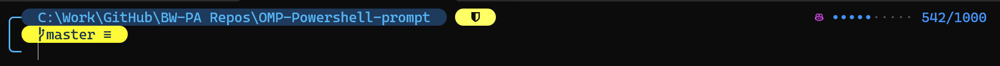

# Oh My Posh PowerShell Prompt

A clean, multi-line PowerShell prompt built with [Oh My Posh](https://ohmyposh.dev/).



## Features

- **Line 1** — Full directory path in a rounded blue box, context-aware pills (Node, Python, etc.), and a Copilot usage gauge (right-aligned)
- **Line 2** — Git branch and status (only visible in git repos)
- **Line 3** — Clean input cursor with `╰─` connector
- Shield icon when running as Administrator
- Execution time shown for long-running commands
- Exit code displayed on command failure

## Quick Setup

### Prerequisites

- [PowerShell 7+](https://learn.microsoft.com/en-us/powershell/scripting/install/installing-powershell-on-windows)
- [Windows Terminal](https://apps.microsoft.com/store/detail/windows-terminal/9N0DX20HK701) (recommended)

### Install

1. Clone this repo:

   ```powershell
   git clone https://github.com/<your-username>/OMP-Powershell-prompt.git
   ```

2. Run the setup script in an **elevated** (Administrator) PowerShell 7+ terminal:

   ```powershell
   cd OMP-Powershell-prompt
   .\Install-Prompt.ps1
   ```

3. Restart your terminal.

4. Set your terminal font to **CaskaydiaCove Nerd Font**:
   - **Windows Terminal:** Settings → Profiles → Defaults → Appearance → Font face
   - **VS Code:** Settings → Terminal → Integrated: Font Family → `CaskaydiaCove NF`

### Manual Setup

If you prefer to set things up manually:

1. Install Oh My Posh:

   ```powershell
   winget install JanDeDobbeleer.OhMyPosh
   ```

2. Install a [Nerd Font](https://www.nerdfonts.com/font-downloads) (e.g., CaskaydiaCove):

   ```powershell
   oh-my-posh font install CaskaydiaCove
   ```

3. Copy `BenCustomised.omp.json` to your Oh My Posh themes folder:

   ```powershell
   Copy-Item BenCustomised.omp.json "$env:LOCALAPPDATA\Programs\oh-my-posh\themes\"
   ```

4. Add this line to your PowerShell profile (`$PROFILE`):

   ```powershell
   oh-my-posh init pwsh --config "$env:POSH_THEMES_PATH/BenCustomised.omp.json" | Invoke-Expression
   ```

## Customisation

### Copilot Usage Target

The gauge bar target is defined once in the copilot segment template. Find `$t := 1000` in `BenCustomised.omp.json` and change `1000` to your desired target — both the gauge and counter update automatically.

### Colours

| Element | Colour | Hex |
|---------|--------|-----|
| Path box background | Dark navy | `#1e3a5c` |
| Path text / connectors | Light blue | `#56b6f7` |
| Copilot icon | Pink/magenta | `#d946ef` |
| Copilot gauge | Blue | `#4493f8` |

## License

MIT
